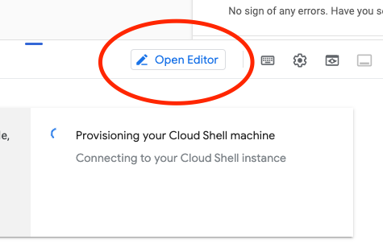
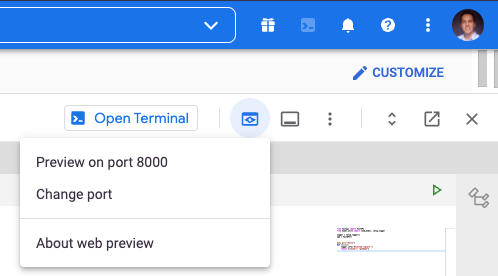

# Introduction: What We're Building Today

Welcome to the FastAPI workshop! Today, we’ll focus on building an API. The goal is to give you hands-on experience with FastAPI, a modern framework that enables us to quickly build data-centric APIs that can handle and validate structured data, store results, and provide endpoints for querying. By the end of this workshop, you’ll have a solid foundation in building APIs. You’ll be able to create APIs that support all kinds of use cases in your company, such as: sharing data, serving machine learning models and more.

This workshop can be challenging if you're not familiar with Python, but don't worry! We'll guide you through the process step-by-step. If you have any questions, feel free to ask. We're here to help you learn and grow. Struggling is part of the learning process, so don't be afraid to make mistakes.

## Workshop Outline
The workshop is structured around a series of exercises that will guide you through the process of building an API in Python using FastAPI. We’ll start with the basics and gradually introduce more advanced concepts. Here’s a brief overview of what we’ll cover:

1. **Setting up a basic API** with a “Hello World” API to get a feel for the environment.
2. **Submit and retrieve data** to handle uploading data entries and querying them.
3. **Validate input data** using Pydantic to ensure data quality and consistency.
4. **Further data validation** extending your Pydantic models by adding constraints and validators.
5. **Connecting to a Database** using SQLite and SQLAlchemy ORM to manage datasets and processed data.
6. **Speed up your API with a cache** to avoid unnecessary database queries and improve performance.
7. **Secure your API (optional)** by implementing a simple API key authentication system.

---

## Using Google Cloud VMs
For this workshop, each of you will work on a dedicated Google Cloud environment. This setup ensures that you won't have problems setting up the work environment, that way you can focus on learning instead of spending time on setup.

---

## FastAPI Documentation
You can find FastAPI’s official documentation here: [FastAPI Documentation](https://fastapi.tiangolo.com/). The documentation is well-organized, and many of the topics we’ll cover today, such as building endpoints, using Pydantic for validation are covered in detail. This will be a helpful reference as you complete each exercise.

---
## Exercises: Building a Data Analytics API
By the end of this training, you'll have created your own basic API using FastAPI, implemented CRUD (Create, Read, Update, Delete) functionality, validated inputs, and connected it to a SQLite database. We’ll work step-by-step, so follow along at your own pace!

---

### Exercise 1: Setting a basic API
**Objective:** Set up your first FastAPI app and get it running. Familiarise yourself with the concepts.
   
### Step-by-Step Instructions:

1. **Environment Setup**
   - Log on to: https://console.cloud.google.com/
   - Click on "activate cloud shell" <br> <br>
   - Click on "open editor" <br> <br>
   - Open a new terminal (go to view > terminal > new terminal) and enter: `git clone https://github.com/JelmerOffenberg/python-api-workshop`. This will clone the repository in your working directory. You should see a folder appear on the left.
   - Go to file > open folder and search for the folder in your home directory that's called `python-api-workshop`.
   - Go to your terminal and type `make environment` this will set up the environment for you.
   - If everything runs without any errors you can proceed. Otherwise, ask for help.
   - Create a `main.py` file, which will serve as the entry point for your API.

2. **Creating a traditional "Hello world" Endpoint**
    - In `main.py`, create a basic FastAPI app and define an endpoint at `/` that returns a JSON response with the message `"Hello world!"`. Remember, endpoints are just Python functions with a decorator in FastAPI, you can check the FastAPI documentation for examples on how to do this.
    - Create a second endpoint at `/info` that provides some information about the API. Think of a logical way to present this information. How is information often sent over the internet? What standard data format is common to use?

3. **Run the API Server with Uvicorn and Explore the Documentation**
    - Start the server by typing `make run` in the terminal and use the preview button in the Google cloud. If you work on your local machine, you can access the API at `http://localhost:8000`. See the image below for the web preview: 
    - 
    - If you got your API running, then you can go back and forth to change things and see the effect.
    - If you want to try out your endpoints in the web browser, you can go to the `/docs` endpoint. It serves an interactive documentation page for developers.
    - **Task:** Familiarize yourself with the automatic documentation. Try out some queries.

### Exercise 1 solution example:

```python
   from fastapi import FastAPI
   
   api = FastAPI()
   
   @api.get("/")
   def hello_world():
       return "Hello world!"
   
   @api.get("/info")
   def info():
       return {"name": "My API", "version": "1.0", "description": "This is a simple API built with FastAPI."}
   ```
---

### Exercise 2: Submit and retrieve data
**Objective:** Develop endpoints for submitting and retrieving data, a common practice. Note that we will use in-memory data storage for now, this means that you'll have to define a python variable where you store your data for the runtime of this application.

If you have no inspiration for what kind of data to submit, take store inventory as an example. Products have a name, price, weight etc.

### Step-by-Step Instructions:

1. **Create a `/data` endpoint where you can submit your data to.**
    - Decide on what your data will look like. Write this down in plain English so that you can use this as a reference for yourself. What data type would you like the user to use?
    - What type of endpoint should this be? (GET, POST, PUT, DELETE)
    - How will you store the data in your application once it's submitted?
    - Create the endpoint that accepts your input and returns a message with data that was received.

2. **Create a `/data` endpoint that retrieves all data that was submitted.**
    - What type of endpoint should this be? (GET, POST, PUT, DELETE)
    - Create the endpoint that allows the user to retrieve data using your API.
    - Test this endpoint by calling it and observe what happens. Do you need to make any changes? Is it working fine?
    - What changes would you have to make to filter and return only a single record (if it exists)?

```python
from fastapi import FastAPI

api = FastAPI()

data = []  # This list is your temporary data store

@app.post("/data")  # This is a POST endpoint configured at /data
def post_data(data: dict) -> dict:  # This function accepts a dictionary as input and returns a dictionary
    data.append(data)  # Add data to the list outside of this function
    return data  # Return the data that was submitted as a confirmation

@app.get("/data")  # This is a GET endpoint configured at /data
def get_data() -> list[dict]:  # This endpoint returns a list of dictionaries
    return data  # Return the data that is stored in the application

# In order to add filtering, you can add *query parameters* to the endpoint and filter the list on that. 
@app.get("/data/{name}")  # This is a GET endpoint configured at /data/{name}
def get_data_by_name(name: str) -> list[dict]:  # This endpoint returns a list of dictionaries
    return [item for item in data if item["name"] == name]  # Return the items that matches the name that was provided

    # Alternatively you can use a for loop to do the same thing, it's more beginner friendly
    result = []
    for item in data:
        if item["name"] == name:
            result.append(item)   
    return result
```

---

### Exercise 3: Use Pydantic for data validation
In the previous exercise, we've submitted simple JSON data to the API using Python dictionaries. However, we want to ensure that the data that is submitted is valid. We can use Pydantic for this. Pydantic is a data validation library that is used in FastAPI to validate data that is submitted to the API.
**Objective**: Define the data model for your endpoint in Pydantic and ensure the API only accepts valid data.

### Step-by-Step Instructions:

1. **Define a Pydantic model for your data**
    - Create a Pydantic model that represents the data. Create an elaborate data model, the fields that should at least be included are:
        - identifier (integer)
        - timestamp: (datetime)
        - location (string)
        - value (float)
        - description (string)
2. **Use the Pydantic Models in your API**
    - Update the `/data` endpoint to use the Pydantic model for validation.
    - What has now changed in your test portal (the `/docs` endpoint)?
    - Test the API by submitting data that is not valid and observe what happens.
    - Depending on how you store your data, you might have to make the appropriate changes after you've introduced Pydantic to ensure that your code still works.
    - Test the API by submitting data and observe what is returned. Does it match the schema that you've defined?
3. **Define return schemas for your API**
    - Define a return schema for your API that defines what the API should return when data is submitted or retrieved.
    - Update the `/data` endpoint to return the data in the format that you've defined in the return schema.
    - Test the API by submitting data and observe what is returned. Does it match the schema that you've defined?
    - What are the benefits of using Pydantic for data validation in your API?
    - What are the potential drawbacks of using Pydantic for data validation in your API?


### Exercise 3 solution example:

```python
from fastapi import FastAPI
from pydantic import BaseModel

api = FastAPI()

data = []  # This list is your temporary data store

class UserInput(BaseModel):  # Define a Pydantic model for the data
    identifier: int
    timestamp: datetime
    location: str
    value: float
    description: str

@app.post("/data")  # This is a POST endpoint configured at /data
def post_data(data: UserInput) -> UserInput:  # This function accepts UserInput as input and returns UserInput
    data.append(data)  # Add data to the list outside of this function
    return data  # Return the data that was submitted as a confirmation

@app.get("/data")  # This is a GET endpoint configured at /data
def get_data() -> list[UserInput]:  # This endpoint returns a list of UserInput
    return data  # Return the data that is stored in the application

# In order to add filtering, you can add *query parameters* to the endpoint and filter the list on that. 
@app.get("/data/{identifier}")  # This is a GET endpoint configured at /data/{name}
def get_data_by_name(identifier: int) -> list[UserInput]:  # This endpoint returns a list of UserInput
    return [item for item in data if item.identifier == identifier]  # Return the items that matches the identifier that was provided

# The benefits of using Pydantic for data validation are that it ensures that the data that is submitted to the API is valid. This can help prevent errors and improve the overall quality of the data that is stored in the application. Additionally, Pydantic provides automatic data conversion and validation, which can save time and effort when working with complex data types.
# The potential drawbacks of using Pydantic for data validation are that it adds complexity to the codebase and might have a small performance impact. It can be difficult to work with for beginners. Additionally, Pydantic might not cover all edge cases or validation requirements, which could require additional custom validation logic.
```

---

### Exercise 4: Extending your Pydantic models by adding constraints and validators
**Objective:** Ensure data quality and integrity by adding constraints and validators to your Pydantic models.

### Step-by-Step Instructions:

1. **Add Constraints to Pydantic Models**
    - Add constraints to your Pydantic model fields to enforce data integrity. For example, ensure that `identifier` is a positive number, and `description` is not empty. For this you can use the pydantic `field_validator`, this will introduce some new concepts. Use the documentation as reference, we'll discuss this exercise together.
    - Test the API by submitting data that violates these constraints and observe how the API handles the validation errors.
        - What happens when you submit data that violates the constraints?
        - What status code is returned?
        - Is this behavior desirable for your API?
2. **Add Validators to Pydantic Models**
    - Add a validator that checks if the `location` field is a valid location (e.g., a known city or country). You can use a simple list of valid locations for this exercise.
    - Test the API by submitting data with invalid locations and observe how the API handles the validation errors.
        - What happens when you submit data with an invalid location?
        - Is the error message informative and user-friendly?
3. **Add some more validators of your liking to the other fields**

### Exercise 4 solution example:

```python
class UserInput(BaseModel):  # Define a Pydantic model for the data
    identifier: int
    timestamp: datetime
    location: str
    value: float
    description: str

    @field_validator("identifier")
    def identifier_must_be_positive(cls, v):
        if v <= 0:
            raise ValueError("identifier must be a positive number")

    @field_validator("description")
    def description_must_not_be_empty(cls, v):
        if not v:
            raise ValueError("description must not be empty")


# If the input is not valid, FastAPI will return a 422 Unprocessable Entity status code and a detailed error message that explains why the input is invalid. This behavior is desirable for the API because it helps ensure data quality and integrity. It provides clear feedback to the user about what is wrong with the input data and how to fix it.
```

---

### Exercise 5: Connecting to a database with SQLite and SQLModel
**Note**: this exercise is a bit more complicated, but we'll go through it step by step. In this exercise, we will introduce a few new concepts. We'll connect our API to a database using SQLModel (a Python library). This might sound complex, but it's actually quite simple. SQLIte is a simple database that is often used for small applications and prototyping. SQLModel is a library that makes it easy to interact with databases in Python.

A SQLite database is generally just a file, this makes it super easy to work with. You can just create a file and start using it as a database. SQLAlchemy will take care of the rest.
**Objective:** Set up a SQLite database to store data, making the data persistent and enabling more complex querying and analysis.

#### Step-by-Step Instructions:

1. **Configure SQLite with SQLModel**
   - I've created a `database.py` file that provides some boilerplate code to get you started. This file will contain the code to interact with the database.
   - Try to run your file and see if the database file is created in your directory. You can check this by running `ls` in your terminal or check the file tree.
   - What are the benefits of using an ORM like SQLModel for database interactions?
   - What are the potential drawbacks of using an ORM like SQLModel for database interactions?

2. **Create a SQLModel Model for your Data**
   - Just as with FastAPI and Pydantic, you can use SQLModel to define data models. Create a SQLModel model in the `database.py` file for your data that *replaces* the Pydantic model you've defined earlier. The data model is the object that is stored in the database.
   - SQLModel is created in such a way that is functions as a Pydantic model, so you can use the same model for both your API and your database! This is a very powerful concept since it allows you to use the same model for both your API and your database.
   - Test the model by creating an instance of it and printing it. Does it work as expected?

2. **Save Uploaded Data to the Database**
   - Update the `/upload` POST endpoint to store each data entry in the SQLite database.
   - Return the newly saved data entry with a unique identifier.

3. **Query Data from the Database**
   - Update the `/data` endpoint to retrieve data from the SQLite database instead of an in-memory list.
   - Add sorting, filtering, and pagination to the `/data` endpoint so users can retrieve data by `category`, `timestamp`, and sorted by `value`.

4. **Optimize Querying with Indexes**
   - Add an index to the `identifier` column of your SQLModel model for faster querying.
   - Test the querying speed before and after indexing with larger data samples, if possible.


### Exercise 5 solution example:

In `database.py`:
```python
from sqlmodel import create_engine, SQLModel, Field

# Any tables that you would define, should be defined below this line using SQLModel.
class User(SQLModel, table=True):
   identifier: int = Field(primary_key=True, index=True)
   username: str


# This is the database engine that will be used to connect to the database.
connect_args = {"check_same_thread": False}
engine = create_engine("sqlite:///sqlite.db", echo=True, connect_args=connect_args)


# This will create the tables in the database. Optionally, you can drop all tables before creating them.
# SQLModel.metadata.drop_all(engine)
SQLModel.metadata.create_all(engine)


if __name__ == '__main__':
   # Use this section to perform any testing of the database.py file.
   print("Hello, World!")
```

In `main.py`:

```python
from fastapi import FastAPI
from src.python_training.api.database import engine, User
from sqlmodel import Session

app = FastAPI()

cache = {}


@app.post("/data")
def create_data(user: User) -> User:
   with Session(engine) as session:
      session.add(user)
      session.commit()
      session.refresh(user)
   return user


@app.get("/data")
def read_data(identifier: int) -> User | None:
   if identifier in cache.keys():
      return cache[identifier]

   with Session(engine) as session:
      user = session.get(User, identifier)

      if user is None:
         return None

      # Store the user by identifier in the cache
      cache[identifier] = user

      return user
```

---

### Exercise 6: Implement a cache system to avoid unnecessary database queries
**Objective:** Improve API performance by implementing a simple in-memory caching system using Python's built-in data structures. The cache will store frequently accessed data, reducing the need for repetitive database queries.

#### Step-by-Step Instructions:

1. **Add an In-Memory Cache**
   - Create a global dictionary or list in your project to act as the cache. You can choose whichever want. This cache will store query results temporarily for faster subsequent retrieval.

2. **Modify the `/data` Endpoint**
   - Before querying the database, check if the requested data exists in the cache.
   - If the data is found in the cache, return it immediately.
   - If the data is not in the cache, query the database, store the result in the cache, and then return it to the user.

3. **Test the Cache**
   - Test your implementation by:
      - Making repeated requests for the same data and observing the response times.
      - You can add logging or print statements to your code to verify when data is retrieved from the cache versus the database.

4. **Additional Task: Reflection**
   - Why do you think caching improves performance? Is this always useful? When might caching be less effective?
   - What challenges might arise when using a cache, and how can they be addressed?

---

### Exercise 7 (OPTIONAL): Extra exercises, cherry pick one or more
**Objective:** Secure your API by implementing a simple API key authentication system. This will allow you to restrict access to your API to only those who have a valid API key.
**Objective:** Implement a cache expiration mechanism to ensure that the cache does not hold outdated or stale data indefinitely.

#### Step-by-Step Instructions:

1. **Create an authentication system**
   - Implement a simple API key authentication system in your FastAPI application.
   - Modify your application to check for the presence of an API key in incoming requests.
   - If the API key is missing or incorrect, return a 401 Unauthorized response.
   - If the API key is valid, allow the request to proceed as normal.

2. **Implement Cache Expiration**
   - Introduce a mechanism to ensure the cache does not hold outdated or stale data indefinitely. This could be a timestamp associated with each cached entry.
   - If the cached data is older than a certain duration (e.g., 5 minutes), remove it from the cache and fetch fresh data from the database.
s with the correct API key and ensuring they are successful.